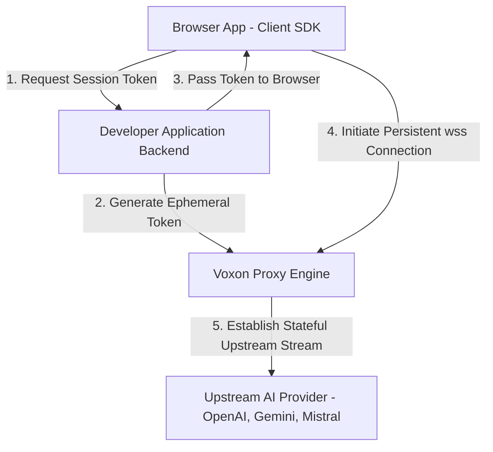
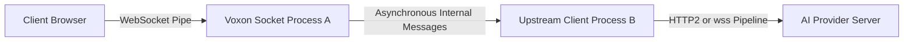

# voxon vision

> This document describes where voxon is going, not what is shipped today. For the current feature set and its limitations, see the [README](README.md).

## 1. Executive Summary

voxon is an open-source, ultra-low-latency WebSocket proxy built in Elixir/Phoenix that normalizes real-time AI transcription APIs and manages secure ephemeral sessions. It abstracts away browser-side audio downsampling and fragmented provider auth layers, allowing any application developer to add a secure mic button to their app with zero boilerplate.

## 2. Core Thesis & The "No-Brainer" North Star

Winning looks like making the decision to add a real-time mic button an absolute no-brainer for every application developer on earth.

Right now, developers face a wall of accidental complexity when building voice interfaces:

- **Audio Engineering Debt:** Browsers record in complex webm/ogg containers with compressed Opus audio. AI models demand raw, high-fidelity 16-bit linear PCM little-endian data at rigid sample rates (16kHz or 24kHz).
- **The Security Trap:** Most modern providers lack client-safe ephemeral token mechanisms or have highly volatile implementations. Leaking a master API key to the browser is a security failure, but proxying stateful binary data pipelines through generic REST/Serverless architecture is an infrastructure failure.
- **Operational Fragmentation:** Switching from Gemini to OpenAI or Mistral forces a complete rewrite of both the backend handshake logic and client-side payload emitters.

**voxon** intercepts this whole problem layer. It acts as a standardized data conduit that does the heavy lifting, exposing a unified, beautiful API surface.

---

## 3. High-Level Architecture

The system splits the work cleanly: the client handles optimized local audio formatting, while the Elixir backend handles high-density stream proxying.

### Inner Process Isolation (The BEAM Advantage)

Inside the proxy, every connection is split into isolated green threads to maximize fault tolerance.

---

## 4. Open-Core Monetization Model

To build trust in the developer community while building a sustainable business, voxon uses a definitive open-core separation.

### The Open-Source Core (`voxon-core`)

- Distributed under an open-source license.
- Contains the absolute full capability of the proxy router, token exchange validation mechanism, stream normalization layer, and termination handlers.
- **Why:** Eliminates the security risk of third-party middlemen handling master infrastructure keys. Developers can audit the engine line-by-line or self-host it freely.

### The Commercial Cloud Platform (`voxon-cloud`)

- A managed, globally distributed SaaS layer running across multi-region edge clusters.
- **Features:** Comprehensive operational dashboard, visual live-stream logs, token access policies, telemetry tracking, and organization-wide usage billing aggregators.
- **Why:** Operating stateful WebSocket clusters — connection draining on deploys, multi-region routing, scaling — is real work. Teams that would rather not own that work can pay us to do it for them.

---

## 5. System Boundary Controls

To maintain predictable operational margins and protect downstream backend systems, voxon enforces hard operational boundaries out of the box:

- **The 35-Minute Hard Wall:** Real-time speech contexts degrade significantly past this mark. Sockets automatically issue a custom closing frame at 35 minutes, protecting customers from runaway bills and freeing up system file descriptors.
- **Client-Side Transcoding Only:** The server will completely reject unformatted containers like WebM or Ogg. CPU-intensive operations (converting float values to 16-bit integers and downsampling audio rates) must happen at the client edge inside browser `AudioWorklet` threads, keeping the proxy light and infinitely scalable.
